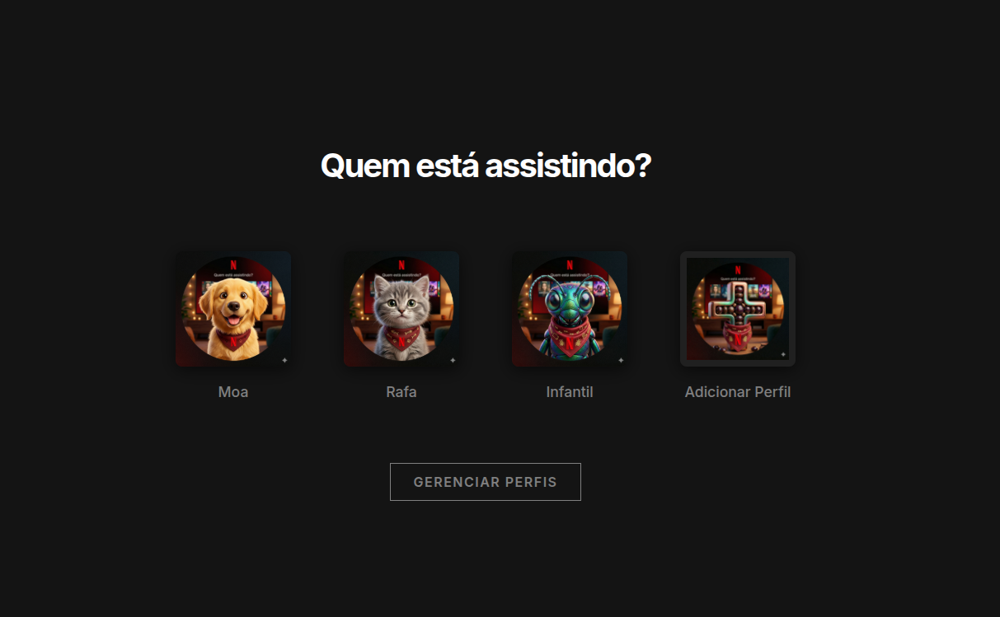
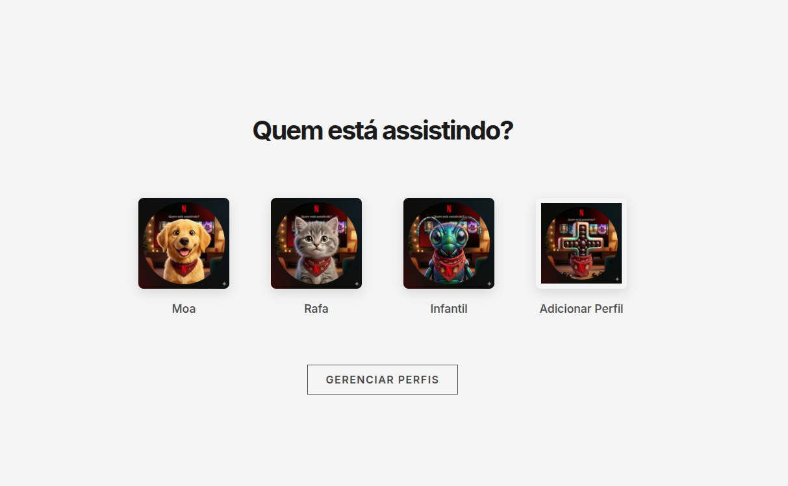

# Imersão AI Frontend - Alura

Projeto desenvolvido durante a **Imersão AI Frontend da Alura**, com foco em construção de interface web utilizando HTML, CSS e JavaScript.

## Sobre o projeto

Este repositório contém uma aplicação frontend simples, com estrutura base para desenvolvimento de páginas interativas e estilizadas.

A organização atual do projeto é:

- `index.html` - estrutura da página
- `style.css` - estilos visuais
- `script.js` - lógica e interatividade
- `assets/` - arquivos estáticos (imagens, ícones, etc.)

## Ferramentas utilizadas

- **HTML5** - marcação da interface
- **CSS3** - estilização da aplicação
- **JavaScript (ES6+)** - comportamento e interações
- **VS Code** - editor de código
- **Git e GitHub** - versionamento e hospedagem do repositório

## Como executar o projeto

1. Clone este repositório:
   ```bash
   git clone <url-do-repositorio>
   ```
2. Acesse a pasta do projeto:
   ```bash
   cd imersao-ai-frontEnd-alura
   ```
3. Abra o arquivo `index.html` no navegador.

## Prints de tela

Adicione abaixo os prints do projeto conforme ele evoluir:

### Tela inicial


<!-- ### Funcionalidade principal
 -->

### Light mode


> Dica: crie a pasta `assets/prints/` para armazenar as imagens e manter o repositório organizado.
